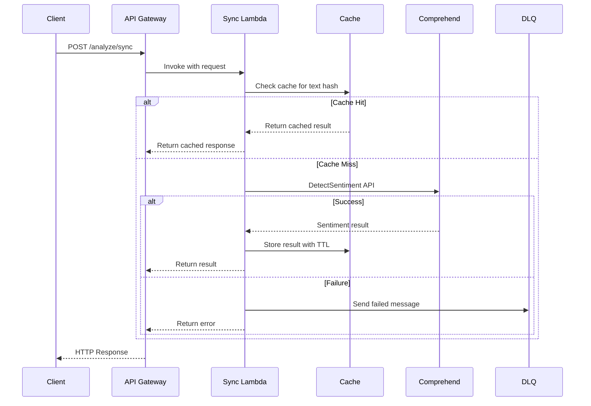
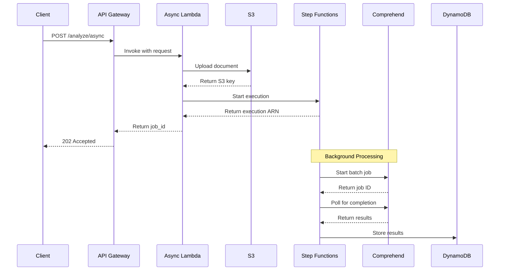
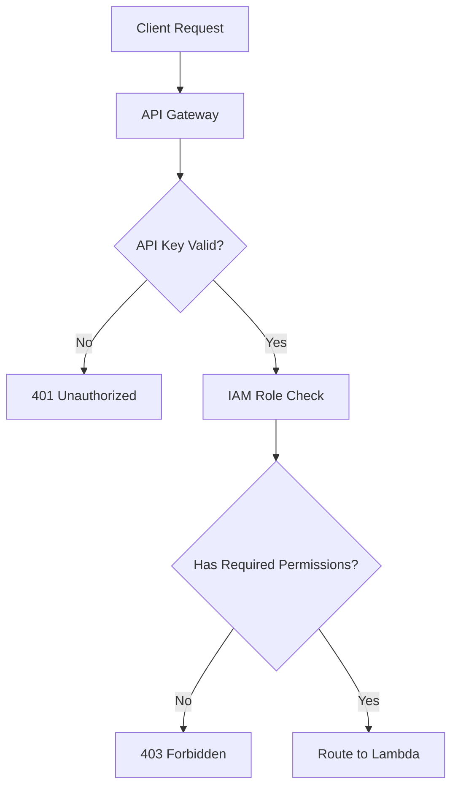

# AuraStream Architecture Reference

## Table of Contents
1. [System Overview](#system-overview)
2. [Architecture Patterns](#architecture-patterns)
3. [Component Design](#component-design)
4. [Data Flow](#data-flow)
5. [Infrastructure Components](#infrastructure-components)
6. [Security Architecture](#security-architecture)
7. [Scalability Design](#scalability-design)
8. [Disaster Recovery](#disaster-recovery)

---

## System Overview

### High-Level Architecture

AuraStream implements a **dual-path serverless architecture** optimized for both real-time and batch sentiment analysis workloads.

```
┌─────────────────────────────────────────────────────────────────┐
│                        Client Applications                      │
│              (Web Apps, Mobile Apps, Backend Services)          │
└─────────────────────┬───────────────────────────────────────────┘
                      │ HTTPS/TLS 1.2+
                      ▼
┌─────────────────────────────────────────────────────────────────┐
│                    AWS API Gateway                             │
│              (Authentication, Rate Limiting, WAF)              │
└─────────────┬─────────────────────────────┬─────────────────────┘
              │                             │
              ▼                             ▼
    ┌─────────────────┐             ┌─────────────────┐
    │  Synchronous    │             │  Asynchronous   │
    │  Processing     │             │  Processing     │
    │  Path           │             │  Path           │
    └─────────────────┘             └─────────────────┘
```

### Design Principles

1. **Serverless-First**: Leverage AWS managed services for scalability and cost optimization
2. **Event-Driven**: Use asynchronous processing for batch workloads
3. **Fault-Tolerant**: Implement retry logic, circuit breakers, and dead letter queues
4. **Security by Design**: Encrypt data at rest and in transit, implement least privilege access
5. **Observability**: Comprehensive logging, monitoring, and tracing
6. **Cost-Optimized**: Intelligent caching and resource right-sizing

---

## Architecture Patterns

### 1. API Gateway Pattern
**Purpose**: Single entry point for all client requests
**Benefits**: 
- Centralized authentication and authorization
- Rate limiting and throttling
- Request/response transformation
- API versioning

### 2. Lambda Function Pattern
**Purpose**: Stateless compute for processing requests
**Benefits**:
- Auto-scaling based on demand
- Pay-per-execution pricing
- No server management overhead
- Fast cold start times

### 3. Event-Driven Architecture
**Purpose**: Decouple batch processing from real-time requests
**Benefits**:
- Improved system resilience
- Better resource utilization
- Easier to scale individual components

### 4. CQRS (Command Query Responsibility Segregation)
**Purpose**: Separate read and write operations
**Benefits**:
- Optimized data access patterns
- Independent scaling of read/write workloads
- Better performance for different use cases

---

## Component Design

### Synchronous Processing Path

```
┌─────────────────┐    ┌─────────────────┐    ┌─────────────────┐
│   API Gateway   │───▶│  Sync Lambda    │───▶│   DynamoDB      │
│                 │    │                 │    │   (Cache)       │
└─────────────────┘    └─────────┬───────┘    └─────────────────┘
                                 │
                                 ▼
                        ┌─────────────────┐
                        │   Comprehend    │
                        │   (Sentiment)   │
                        └─────────────────┘
```

**Components**:
- **API Gateway**: Request routing and authentication
- **Sync Lambda**: Request processing and caching logic
- **DynamoDB Cache**: Response caching for duplicate queries
- **Amazon Comprehend**: Sentiment analysis service

**Performance Characteristics**:
- **Target Latency**: P99 < 1000ms
- **Throughput**: 1000 RPS sustained, 5000 RPS burst
- **Cache Hit Rate**: > 60% for repeated queries

### Asynchronous Processing Path

```
┌─────────────────┐    ┌─────────────────┐    ┌─────────────────┐
│   API Gateway   │───▶│  Async Lambda   │───▶│   S3 Bucket     │
│                 │    │                 │    │ (Document Store)│
└─────────────────┘    └─────────────────┘    └─────────┬───────┘
                                                        │
                                                        ▼
                                               ┌─────────────────┐
                                               │ Step Functions  │
                                               │ (Orchestration) │
                                               └─────────┬───────┘
                                                         │
                                                         ▼
                                               ┌─────────────────┐
                                               │   Comprehend    │
                                               │   (Batch API)   │
                                               └─────────┬───────┘
                                                         │
                                                         ▼
                                               ┌─────────────────┐
                                               │   DynamoDB      │
                                               │ (Job Results)   │
                                               └─────────────────┘
```

**Components**:
- **API Gateway**: Request routing and job initiation
- **Async Lambda**: Job creation and S3 upload
- **S3 Bucket**: Document storage with lifecycle policies
- **Step Functions**: Workflow orchestration
- **Comprehend Batch API**: Bulk sentiment analysis
- **DynamoDB**: Job status and result storage

**Performance Characteristics**:
- **Job Processing Time**: < 5 minutes for 1MB documents
- **Concurrent Jobs**: Up to 100 simultaneous jobs
- **Throughput**: 100 jobs/minute sustained

---

## Data Flow

### Synchronous Request Flow



### Asynchronous Request Flow



---

## Infrastructure Components

### AWS Services Used

| Service | Purpose | Configuration |
|---------|---------|---------------|
| **API Gateway** | REST API endpoint | Regional, REST API, API Keys |
| **Lambda** | Compute functions | Python 3.9, 256MB-1GB memory |
| **DynamoDB** | NoSQL database | On-demand billing, TTL enabled |
| **S3** | Object storage | Standard storage, lifecycle policies |
| **Step Functions** | Workflow orchestration | Standard workflows |
| **SQS** | Message queuing | Dead letter queues |
| **CloudWatch** | Monitoring | Custom metrics, alarms |
| **X-Ray** | Distributed tracing | Sampling rate: 10% |
| **Comprehend** | ML service | DetectSentiment, Batch APIs |

### Network Architecture

```
┌─────────────────────────────────────────────────────────────┐
│                    Internet Gateway                         │
└─────────────────────┬───────────────────────────────────────┘
                      │
┌─────────────────────▼───────────────────────────────────────┐
│                    VPC (10.0.0.0/16)                       │
│  ┌─────────────────┐  ┌─────────────────┐                  │
│  │   Public Subnet │  │  Private Subnet │                  │
│  │   (10.0.1.0/24) │  │   (10.0.2.0/24) │                  │
│  │                 │  │                 │                  │
│  │  API Gateway    │  │  Lambda         │                  │
│  │  (Internet      │  │  Functions      │                  │
│  │  Facing)        │  │  (Internal)     │                  │
│  └─────────────────┘  └─────────────────┘                  │
└─────────────────────────────────────────────────────────────┘
```

### Data Storage Architecture

#### DynamoDB Tables

**Sentiment Cache Table**:
```yaml
TableName: AuraStream-SentimentCache
PartitionKey: text_hash (String)
Attributes:
  - text_hash: String (SHA256 of normalized text)
  - sentiment_result: Map (sentiment, score, language_code)
  - created_at: Number (Unix timestamp)
  - ttl: Number (24 hours from creation)
BillingMode: ON_DEMAND
TTL: ttl
```

**Job Results Table**:
```yaml
TableName: AuraStream-JobResults
PartitionKey: job_id (String)
Attributes:
  - job_id: String (UUID)
  - status: String (PENDING|PROCESSING|COMPLETED|FAILED)
  - result: Map (sentiment analysis results)
  - created_at: Number (Unix timestamp)
  - completed_at: Number (Unix timestamp)
  - error_message: String (if failed)
BillingMode: ON_DEMAND
```

#### S3 Bucket Structure

```
aura-stream-documents/
├── uploads/
│   ├── 2024/01/15/
│   │   ├── job_12345/
│   │   │   └── document.txt
│   │   └── job_12346/
│   │       └── batch_data.csv
├── processed/
│   └── 2024/01/15/
│       └── job_12345/
│           └── results.json
└── failed/
    └── 2024/01/15/
        └── job_12347/
            └── error_log.txt
```

---

## Security Architecture

### Authentication & Authorization



**Security Layers**:
1. **API Gateway**: API Key authentication
2. **IAM Roles**: Least privilege access policies
3. **VPC**: Network isolation
4. **Encryption**: Data at rest and in transit

### IAM Policies

**Lambda Execution Role**:
```json
{
  "Version": "2012-10-17",
  "Statement": [
    {
      "Effect": "Allow",
      "Action": [
        "comprehend:DetectSentiment",
        "comprehend:StartSentimentDetectionJob",
        "comprehend:DescribeSentimentDetectionJob"
      ],
      "Resource": "*"
    },
    {
      "Effect": "Allow",
      "Action": [
        "dynamodb:GetItem",
        "dynamodb:PutItem",
        "dynamodb:UpdateItem"
      ],
      "Resource": "arn:aws:dynamodb:*:*:table/AuraStream-*"
    },
    {
      "Effect": "Allow",
      "Action": [
        "s3:GetObject",
        "s3:PutObject"
      ],
      "Resource": "arn:aws:s3:::aura-stream-documents/*"
    }
  ]
}
```

### Data Protection

**Encryption at Rest**:
- **S3**: AES-256 server-side encryption
- **DynamoDB**: AWS managed keys (KMS)
- **Lambda**: Environment variables encrypted with KMS

**Encryption in Transit**:
- **API Gateway**: TLS 1.2+ for all HTTPS requests
- **Lambda**: VPC endpoints for internal communication
- **S3**: HTTPS for all object operations

**PII Protection**:
```python
# PII Detection Pipeline
Input Text → Comprehend PII Detection → Redaction → Sentiment Analysis
```

---

## Scalability Design

### Auto-Scaling Configuration

**Lambda Concurrency**:
- **Sync Functions**: 1000 concurrent executions
- **Async Functions**: 100 concurrent executions
- **Reserved Concurrency**: 50 for critical functions

**DynamoDB Scaling**:
- **Billing Mode**: On-demand for automatic scaling
- **Read/Write Capacity**: Auto-scaling based on demand
- **Global Secondary Indexes**: For efficient querying

**API Gateway Throttling**:
- **Default Rate**: 10,000 requests/second
- **Burst Capacity**: 5,000 requests
- **Per-Key Limits**: Configurable per customer

### Performance Optimization

**Caching Strategy**:
```python
# Cache Key Generation
import hashlib
import re

def generate_cache_key(text: str) -> str:
    # Normalize text (lowercase, remove extra spaces)
    normalized = re.sub(r'\s+', ' ', text.lower().strip())
    # Generate SHA256 hash
    return hashlib.sha256(normalized.encode()).hexdigest()
```

**Connection Pooling**:
- **Boto3**: Session reuse across Lambda invocations
- **HTTP Keep-Alive**: Enabled for external API calls
- **Connection Timeout**: 30 seconds for Comprehend API

---

## Disaster Recovery

### Backup Strategy

**Data Backup**:
- **S3**: Cross-region replication enabled
- **DynamoDB**: Point-in-time recovery enabled
- **Lambda Code**: Versioned in S3 with cross-region backup

**Infrastructure Backup**:
- **CloudFormation Templates**: Stored in version control
- **Infrastructure as Code**: Terraform state in S3 with versioning
- **Configuration**: Parameter Store with cross-region replication

### Recovery Procedures

**RTO (Recovery Time Objective)**: 4 hours
**RPO (Recovery Point Objective)**: 1 hour

**Recovery Steps**:
1. **Assess Impact**: Determine scope of failure
2. **Activate DR Region**: Deploy infrastructure in secondary region
3. **Data Recovery**: Restore from cross-region backups
4. **DNS Failover**: Update Route 53 health checks
5. **Validate Service**: Run health checks and smoke tests

### Business Continuity

**Multi-Region Deployment**:
- **Primary Region**: us-east-1 (N. Virginia)
- **DR Region**: us-west-2 (Oregon)
- **Failover**: Automated via Route 53 health checks

**Data Replication**:
```yaml
# S3 Cross-Region Replication
SourceBucket: aura-stream-documents-us-east-1
DestinationBucket: aura-stream-documents-us-west-2
ReplicationRule:
  Status: Enabled
  Priority: 1
  Filter:
    Prefix: ""
  Destination:
    Bucket: arn:aws:s3:::aura-stream-documents-us-west-2
    StorageClass: STANDARD
```

---

## Monitoring & Observability

### Key Metrics

**Performance Metrics**:
- **Latency**: P50, P95, P99 response times
- **Throughput**: Requests per second
- **Error Rate**: 4xx and 5xx error percentages
- **Cache Hit Rate**: Percentage of cache hits

**Business Metrics**:
- **Sentiment Distribution**: Positive/Negative/Neutral ratios
- **Processing Volume**: Documents processed per day
- **Cost per Analysis**: Average cost per sentiment analysis
- **Customer Usage**: API calls per customer

**Infrastructure Metrics**:
- **Lambda Duration**: Function execution time
- **DynamoDB Throttling**: Read/Write capacity exceeded
- **S3 Request Metrics**: Object operations
- **Comprehend API Usage**: API call volume and costs

### Alerting Strategy

**Critical Alerts** (Immediate Response):
- Error rate > 5%
- P99 latency > 2000ms
- Service availability < 99%
- Cost anomaly > 50% increase

**Warning Alerts** (Business Hours Response):
- Cache hit rate < 50%
- DynamoDB throttling events
- Lambda cold start duration > 5s
- Queue depth > 100 messages

### Dashboards

**Operational Dashboard**:
- Real-time system health
- Error rates and latency trends
- Infrastructure utilization
- Cost tracking

**Business Dashboard**:
- Sentiment analysis trends
- Customer usage patterns
- Revenue and cost analysis
- SLA compliance metrics

---

This architecture reference provides a comprehensive technical foundation for understanding, implementing, and maintaining the AuraStream system. It serves as the single source of truth for architectural decisions and technical specifications.
