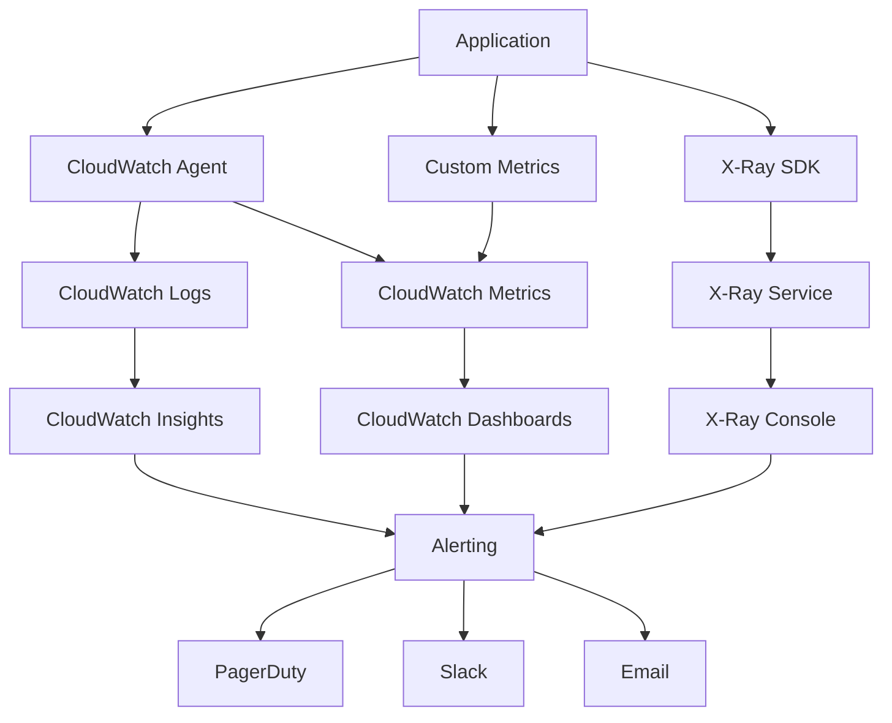

# AuraStream Monitoring & Observability Guide

## Table of Contents
1. [Monitoring Overview](#monitoring-overview)
2. [Observability Architecture](#observability-architecture)
3. [Metrics and Monitoring](#metrics-and-monitoring)
4. [Logging Strategy](#logging-strategy)
5. [Distributed Tracing](#distributed-tracing)
6. [Alerting and Incident Management](#alerting-and-incident-management)
7. [Performance Monitoring](#performance-monitoring)
8. [Business Metrics](#business-metrics)
9. [Cost Monitoring](#cost-monitoring)
10. [Monitoring Tools and Dashboards](#monitoring-tools-and-dashboards)

---

## Monitoring Overview

### Monitoring Philosophy

AuraStream implements a comprehensive monitoring and observability strategy based on the **Three Pillars of Observability**:

1. **Metrics**: Quantitative data about system behavior
2. **Logs**: Detailed records of events and activities
3. **Traces**: Request flow through distributed systems

### Monitoring Objectives

#### Primary Goals
- **Service Availability**: 99.9% uptime SLA
- **Performance**: P99 latency < 1000ms
- **Reliability**: Error rate < 1%
- **Cost Efficiency**: Optimize resource utilization
- **Security**: Detect and respond to threats

#### Key Principles
- **Proactive Monitoring**: Detect issues before they impact users
- **Comprehensive Coverage**: Monitor all system components
- **Actionable Alerts**: Clear, actionable notifications
- **Historical Analysis**: Trend analysis and capacity planning
- **Business Impact**: Connect technical metrics to business outcomes

### Monitoring Maturity Model

| Level | Description | Capabilities |
|-------|-------------|--------------|
| **Level 1** | Basic Monitoring | Infrastructure metrics, basic alerts |
| **Level 2** | Application Monitoring | Application metrics, error tracking |
| **Level 3** | User Experience Monitoring | End-to-end performance, user journeys |
| **Level 4** | Business Intelligence | Business metrics, predictive analytics |
| **Level 5** | Autonomous Operations | Self-healing, predictive maintenance |

**AuraStream Target**: Level 4 (Business Intelligence)

---

## Observability Architecture

### High-Level Architecture

```
┌─────────────────────────────────────────────────────────────────┐
│                    Observability Stack                         │
├─────────────────────────────────────────────────────────────────┤
│  Data Collection Layer                                          │
│  ┌─────────────┐ ┌─────────────┐ ┌─────────────┐              │
│  │   Metrics   │ │    Logs     │ │   Traces    │              │
│  │ Collection  │ │ Collection  │ │ Collection  │              │
│  └─────────────┘ └─────────────┘ └─────────────┘              │
├─────────────────────────────────────────────────────────────────┤
│  Data Processing Layer                                          │
│  ┌─────────────┐ ┌─────────────┐ ┌─────────────┐              │
│  │  CloudWatch │ │  CloudWatch │ │    X-Ray    │              │
│  │   Metrics   │ │    Logs     │ │   Traces    │              │
│  └─────────────┘ └─────────────┘ └─────────────┘              │
├─────────────────────────────────────────────────────────────────┤
│  Analysis and Visualization Layer                               │
│  ┌─────────────┐ ┌─────────────┐ ┌─────────────┐              │
│  │ Dashboards  │ │   Alerts    │ │  Analytics  │              │
│  │             │ │             │ │             │              │
│  └─────────────┘ └─────────────┘ └─────────────┘              │
└─────────────────────────────────────────────────────────────────┘
```

### Data Flow Architecture



### Component Responsibilities

#### Data Collection
- **CloudWatch Agent**: System and application metrics
- **X-Ray SDK**: Distributed tracing
- **Custom Metrics**: Business and application-specific metrics
- **Log Agents**: Centralized log collection

#### Data Processing
- **CloudWatch**: Metrics aggregation and storage
- **X-Ray**: Trace analysis and visualization
- **CloudWatch Insights**: Log analysis and querying

#### Visualization and Alerting
- **Dashboards**: Real-time system visualization
- **Alerts**: Automated incident detection
- **Reports**: Historical analysis and trends

---

## Metrics and Monitoring

### Metrics Categories

#### 1. Infrastructure Metrics

**AWS Service Metrics**:
```python
# CloudWatch metrics for AWS services
infrastructure_metrics = {
    'api_gateway': [
        'Count',                    # Request count
        'Latency',                  # Response latency
        '4XXError',                 # Client errors
        '5XXError',                 # Server errors
        'IntegrationLatency',       # Backend latency
        'CacheHitCount',            # Cache performance
        'CacheMissCount'
    ],
    'lambda': [
        'Invocations',              # Function invocations
        'Errors',                   # Function errors
        'Duration',                 # Execution time
        'Throttles',                # Throttled invocations
        'ConcurrentExecutions',     # Concurrent executions
        'DeadLetterErrors',         # DLQ errors
        'InitDuration'              # Cold start time
    ],
    'dynamodb': [
        'ConsumedReadCapacityUnits',    # Read capacity
        'ConsumedWriteCapacityUnits',   # Write capacity
        'ThrottledRequests',            # Throttled requests
        'SuccessfulRequestLatency',     # Request latency
        'UserErrors',                   # User errors
        'SystemErrors'                  # System errors
    ],
    's3': [
        'BucketSizeBytes',          # Bucket size
        'NumberOfObjects',          # Object count
        'AllRequests',              # Total requests
        'GetRequests',              # GET requests
        'PutRequests',              # PUT requests
        'DeleteRequests'            # DELETE requests
    ]
}
```

#### 2. Application Metrics

**Custom Application Metrics**:
```python
import boto3
from datetime import datetime
from typing import Dict, Any

class ApplicationMetrics:
    def __init__(self):
        self.cloudwatch = boto3.client('cloudwatch')
        self.namespace = 'AuraStream/Application'
    
    def record_sentiment_analysis(self, sentiment: str, confidence: float, processing_time: int):
        """
        Record sentiment analysis metrics.
        
        Args:
            sentiment: Sentiment result (POSITIVE, NEGATIVE, NEUTRAL, MIXED)
            confidence: Confidence score (0.0-1.0)
            processing_time: Processing time in milliseconds
        """
        metrics = [
            {
                'MetricName': 'SentimentAnalysisCount',
                'Value': 1,
                'Unit': 'Count',
                'Dimensions': [
                    {'Name': 'Sentiment', 'Value': sentiment}
                ]
            },
            {
                'MetricName': 'SentimentConfidence',
                'Value': confidence,
                'Unit': 'None',
                'Dimensions': [
                    {'Name': 'Sentiment', 'Value': sentiment}
                ]
            },
            {
                'MetricName': 'ProcessingTime',
                'Value': processing_time,
                'Unit': 'Milliseconds',
                'Dimensions': [
                    {'Name': 'Sentiment', 'Value': sentiment}
                ]
            }
        ]
        
        self._put_metrics(metrics)
    
    def record_cache_performance(self, cache_hit: bool, cache_key: str):
        """
        Record cache performance metrics.
        
        Args:
            cache_hit: Whether cache hit occurred
            cache_key: Cache key identifier
        """
        metrics = [
            {
                'MetricName': 'CacheHitCount' if cache_hit else 'CacheMissCount',
                'Value': 1,
                'Unit': 'Count'
            },
            {
                'MetricName': 'CacheHitRate',
                'Value': 1 if cache_hit else 0,
                'Unit': 'None'
            }
        ]
        
        self._put_metrics(metrics)
    
    def record_api_usage(self, endpoint: str, customer_id: str, response_time: int, status_code: int):
        """
        Record API usage metrics.
        
        Args:
            endpoint: API endpoint
            customer_id: Customer identifier
            response_time: Response time in milliseconds
            status_code: HTTP status code
        """
        metrics = [
            {
                'MetricName': 'APIRequestCount',
                'Value': 1,
                'Unit': 'Count',
                'Dimensions': [
                    {'Name': 'Endpoint', 'Value': endpoint},
                    {'Name': 'CustomerId', 'Value': customer_id},
                    {'Name': 'StatusCode', 'Value': str(status_code)}
                ]
            },
            {
                'MetricName': 'APIResponseTime',
                'Value': response_time,
                'Unit': 'Milliseconds',
                'Dimensions': [
                    {'Name': 'Endpoint', 'Value': endpoint},
                    {'Name': 'CustomerId', 'Value': customer_id}
                ]
            }
        ]
        
        self._put_metrics(metrics)
    
    def _put_metrics(self, metrics: list):
        """Put metrics to CloudWatch."""
        try:
            self.cloudwatch.put_metric_data(
                Namespace=self.namespace,
                MetricData=metrics
            )
        except Exception as e:
            logger.error(f"Failed to put metrics: {e}")
```

#### 3. Business Metrics

**Customer and Revenue Metrics**:
```python
class BusinessMetrics:
    def __init__(self):
        self.cloudwatch = boto3.client('cloudwatch')
        self.namespace = 'AuraStream/Business'
    
    def record_customer_activity(self, customer_id: str, activity_type: str, value: float):
        """
        Record customer activity metrics.
        
        Args:
            customer_id: Customer identifier
            activity_type: Type of activity
            value: Activity value
        """
        metrics = [
            {
                'MetricName': 'CustomerActivity',
                'Value': value,
                'Unit': 'Count',
                'Dimensions': [
                    {'Name': 'CustomerId', 'Value': customer_id},
                    {'Name': 'ActivityType', 'Value': activity_type}
                ]
            }
        ]
        
        self._put_metrics(metrics)
    
    def record_revenue_metrics(self, customer_id: str, revenue: float, usage: int):
        """
        Record revenue and usage metrics.
        
        Args:
            customer_id: Customer identifier
            revenue: Revenue amount
            usage: Usage quantity
        """
        metrics = [
            {
                'MetricName': 'Revenue',
                'Value': revenue,
                'Unit': 'None',
                'Dimensions': [
                    {'Name': 'CustomerId', 'Value': customer_id}
                ]
            },
            {
                'MetricName': 'Usage',
                'Value': usage,
                'Unit': 'Count',
                'Dimensions': [
                    {'Name': 'CustomerId', 'Value': customer_id}
                ]
            }
        ]
        
        self._put_metrics(metrics)
```

### Metric Aggregation and Storage

#### CloudWatch Metrics Configuration

```yaml
# CloudWatch metrics configuration
Resources:
  # Custom metric alarms
  HighErrorRateAlarm:
    Type: AWS::CloudWatch::Alarm
    Properties:
      AlarmName: AuraStream-High-Error-Rate
      AlarmDescription: High error rate detected
      MetricName: 5XXError
      Namespace: AWS/ApiGateway
      Statistic: Sum
      Period: 300
      EvaluationPeriods: 2
      Threshold: 10
      ComparisonOperator: GreaterThanThreshold
      Dimensions:
        - Name: ApiName
          Value: aurastream-api
      AlarmActions:
        - !Ref HighErrorRateSNSTopic

  # Performance alarm
  HighLatencyAlarm:
    Type: AWS::CloudWatch::Alarm
    Properties:
      AlarmName: AuraStream-High-Latency
      AlarmDescription: High latency detected
      MetricName: Latency
      Namespace: AWS/ApiGateway
      Statistic: p99
      Period: 300
      EvaluationPeriods: 3
      Threshold: 2000
      ComparisonOperator: GreaterThanThreshold
      Dimensions:
        - Name: ApiName
          Value: aurastream-api
      AlarmActions:
        - !Ref HighLatencySNSTopic
```

---

## Logging Strategy

### Logging Architecture

#### Log Collection and Processing

```python
import logging
import json
from datetime import datetime
from typing import Dict, Any, Optional

class StructuredLogger:
    def __init__(self, name: str, level: str = 'INFO'):
        self.logger = logging.getLogger(name)
        self.logger.setLevel(getattr(logging, level.upper()))
        
        # Create CloudWatch handler
        handler = logging.StreamHandler()
        formatter = logging.Formatter(
            '%(asctime)s - %(name)s - %(levelname)s - %(message)s'
        )
        handler.setFormatter(formatter)
        self.logger.addHandler(handler)
    
    def log_request(self, request_id: str, method: str, path: str, 
                   customer_id: str, user_agent: str, ip_address: str):
        """
        Log API request with structured data.
        
        Args:
            request_id: Unique request identifier
            method: HTTP method
            path: Request path
            customer_id: Customer identifier
            user_agent: User agent string
            ip_address: Client IP address
        """
        log_data = {
            'event_type': 'api_request',
            'request_id': request_id,
            'method': method,
            'path': path,
            'customer_id': customer_id,
            'user_agent': user_agent,
            'ip_address': ip_address,
            'timestamp': datetime.utcnow().isoformat()
        }
        
        self.logger.info(json.dumps(log_data))
    
    def log_response(self, request_id: str, status_code: int, 
                    response_time: int, cache_hit: bool):
        """
        Log API response with structured data.
        
        Args:
            request_id: Unique request identifier
            status_code: HTTP status code
            response_time: Response time in milliseconds
            cache_hit: Whether response was served from cache
        """
        log_data = {
            'event_type': 'api_response',
            'request_id': request_id,
            'status_code': status_code,
            'response_time': response_time,
            'cache_hit': cache_hit,
            'timestamp': datetime.utcnow().isoformat()
        }
        
        self.logger.info(json.dumps(log_data))
    
    def log_error(self, request_id: str, error_type: str, 
                 error_message: str, stack_trace: Optional[str] = None):
        """
        Log error with structured data.
        
        Args:
            request_id: Unique request identifier
            error_type: Type of error
            error_message: Error message
            stack_trace: Optional stack trace
        """
        log_data = {
            'event_type': 'error',
            'request_id': request_id,
            'error_type': error_type,
            'error_message': error_message,
            'stack_trace': stack_trace,
            'timestamp': datetime.utcnow().isoformat()
        }
        
        self.logger.error(json.dumps(log_data))
    
    def log_business_event(self, event_type: str, customer_id: str, 
                          data: Dict[str, Any]):
        """
        Log business event with structured data.
        
        Args:
            event_type: Type of business event
            customer_id: Customer identifier
            data: Event data
        """
        log_data = {
            'event_type': f'business_{event_type}',
            'customer_id': customer_id,
            'data': data,
            'timestamp': datetime.utcnow().isoformat()
        }
        
        self.logger.info(json.dumps(log_data))
```

### Log Levels and Categories

#### Log Level Configuration

```python
# Log level configuration
LOG_LEVELS = {
    'DEBUG': {
        'level': 10,
        'description': 'Detailed information for debugging',
        'use_cases': ['Development', 'Troubleshooting']
    },
    'INFO': {
        'level': 20,
        'description': 'General information about system operation',
        'use_cases': ['Production monitoring', 'Business events']
    },
    'WARNING': {
        'level': 30,
        'description': 'Something unexpected happened',
        'use_cases': ['Performance issues', 'Configuration problems']
    },
    'ERROR': {
        'level': 40,
        'description': 'Error occurred but system can continue',
        'use_cases': ['Application errors', 'Service failures']
    },
    'CRITICAL': {
        'level': 50,
        'description': 'Serious error occurred',
        'use_cases': ['System failures', 'Security incidents']
    }
}

# Log categories
LOG_CATEGORIES = {
    'security': {
        'level': 'INFO',
        'retention': '7 years',
        'sensitive': True
    },
    'audit': {
        'level': 'INFO',
        'retention': '7 years',
        'sensitive': True
    },
    'application': {
        'level': 'INFO',
        'retention': '30 days',
        'sensitive': False
    },
    'performance': {
        'level': 'INFO',
        'retention': '90 days',
        'sensitive': False
    },
    'business': {
        'level': 'INFO',
        'retention': '1 year',
        'sensitive': True
    }
}
```

### Log Analysis and Querying

#### CloudWatch Insights Queries

```sql
-- Query for high error rates
fields @timestamp, @message
| filter @message like /ERROR/
| stats count() by bin(5m)

-- Query for slow requests
fields @timestamp, @message
| filter @message like /api_response/
| filter response_time > 1000
| sort @timestamp desc

-- Query for customer usage patterns
fields @timestamp, @message
| filter @message like /business_/
| filter customer_id = "customer_123"
| stats count() by bin(1h)

-- Query for security events
fields @timestamp, @message
| filter @message like /security/
| filter event_type = "failed_authentication"
| sort @timestamp desc
```

#### Log Retention and Archival

```yaml
# CloudWatch log group configuration
Resources:
  APIGatewayLogGroup:
    Type: AWS::Logs::LogGroup
    Properties:
      LogGroupName: /aws/apigateway/aurastream
      RetentionInDays: 30

  LambdaLogGroup:
    Type: AWS::Logs::LogGroup
    Properties:
      LogGroupName: /aws/lambda/aurastream-sync-handler
      RetentionInDays: 14

  SecurityLogGroup:
    Type: AWS::Logs::LogGroup
    Properties:
      LogGroupName: /aws/aurastream/security
      RetentionInDays: 2555  # 7 years

  AuditLogGroup:
    Type: AWS::Logs::LogGroup
    Properties:
      LogGroupName: /aws/aurastream/audit
      RetentionInDays: 2555  # 7 years
```

---

## Distributed Tracing

### X-Ray Integration

#### X-Ray Configuration

```python
from aws_xray_sdk.core import xray_recorder
from aws_xray_sdk.core import patch_all
import boto3

# Patch all libraries for X-Ray
patch_all()

class XRayTracing:
    def __init__(self):
        self.xray_recorder = xray_recorder
    
    @xray_recorder.capture('sentiment_analysis')
    def analyze_sentiment(self, text: str, options: dict = None):
        """
        Analyze sentiment with X-Ray tracing.
        
        Args:
            text: Text to analyze
            options: Analysis options
            
        Returns:
            Sentiment analysis result
        """
        # Add custom metadata
        self.xray_recorder.put_metadata('text_length', len(text))
        self.xray_recorder.put_metadata('has_options', bool(options))
        
        # Trace external service calls
        with self.xray_recorder.capture('comprehend_api'):
            result = self._call_comprehend_api(text, options)
        
        # Trace cache operations
        with self.xray_recorder.capture('cache_operation'):
            cache_result = self._check_cache(text)
        
        return result
    
    @xray_recorder.capture('comprehend_api')
    def _call_comprehend_api(self, text: str, options: dict):
        """Call Amazon Comprehend API with tracing."""
        comprehend = boto3.client('comprehend')
        
        try:
            response = comprehend.detect_sentiment(
                Text=text,
                LanguageCode=options.get('language_code', 'en')
            )
            
            # Add response metadata
            self.xray_recorder.put_metadata('sentiment', response['Sentiment'])
            self.xray_recorder.put_metadata('confidence', response['SentimentScore'])
            
            return response
            
        except Exception as e:
            # Add error metadata
            self.xray_recorder.put_metadata('error', str(e))
            raise
    
    @xray_recorder.capture('cache_operation')
    def _check_cache(self, text: str):
        """Check cache with tracing."""
        dynamodb = boto3.resource('dynamodb')
        table = dynamodb.Table('AuraStream-SentimentCache')
        
        try:
            cache_key = self._generate_cache_key(text)
            response = table.get_item(Key={'text_hash': cache_key})
            
            # Add cache metadata
            cache_hit = 'Item' in response
            self.xray_recorder.put_metadata('cache_hit', cache_hit)
            self.xray_recorder.put_metadata('cache_key', cache_key)
            
            return response.get('Item')
            
        except Exception as e:
            self.xray_recorder.put_metadata('cache_error', str(e))
            raise
```

#### X-Ray Sampling Configuration

```python
# X-Ray sampling configuration
SAMPLING_RULES = {
    "version": 2,
    "rules": [
        {
            "description": "Default sampling rule",
            "service_name": "*",
            "http_method": "*",
            "url_path": "*",
            "fixed_target": 1,
            "rate": 0.1
        },
        {
            "description": "High priority for errors",
            "service_name": "*",
            "http_method": "*",
            "url_path": "*",
            "fixed_target": 10,
            "rate": 1.0,
            "attributes": {
                "http.status_code": "4*"
            }
        },
        {
            "description": "Critical endpoints",
            "service_name": "aurastream-api",
            "http_method": "*",
            "url_path": "/analyze/*",
            "fixed_target": 5,
            "rate": 0.5
        }
    ]
}
```

### Trace Analysis

#### Performance Analysis

```python
class TraceAnalyzer:
    def __init__(self):
        self.xray_client = boto3.client('xray')
    
    def analyze_trace_performance(self, trace_id: str) -> dict:
        """
        Analyze trace performance.
        
        Args:
            trace_id: X-Ray trace ID
            
        Returns:
            Performance analysis results
        """
        try:
            # Get trace data
            response = self.xray_client.get_trace(TraceIds=[trace_id])
            trace = response['Traces'][0]
            
            # Analyze segments
            segments = trace['Segments']
            performance_data = {
                'total_duration': trace['Duration'],
                'segment_count': len(segments),
                'segments': []
            }
            
            for segment in segments:
                segment_data = json.loads(segment['Document'])
                performance_data['segments'].append({
                    'name': segment_data.get('name'),
                    'duration': segment_data.get('duration'),
                    'start_time': segment_data.get('start_time'),
                    'end_time': segment_data.get('end_time'),
                    'subsegments': len(segment_data.get('subsegments', []))
                })
            
            return performance_data
            
        except Exception as e:
            logger.error(f"Failed to analyze trace {trace_id}: {e}")
            return {}
    
    def identify_performance_bottlenecks(self, trace_id: str) -> list:
        """
        Identify performance bottlenecks in trace.
        
        Args:
            trace_id: X-Ray trace ID
            
        Returns:
            List of bottlenecks
        """
        performance_data = self.analyze_trace_performance(trace_id)
        bottlenecks = []
        
        for segment in performance_data['segments']:
            # Identify slow segments (> 1000ms)
            if segment['duration'] > 1000:
                bottlenecks.append({
                    'type': 'slow_segment',
                    'segment': segment['name'],
                    'duration': segment['duration'],
                    'threshold': 1000
                })
            
            # Identify segments with many subsegments
            if segment['subsegments'] > 10:
                bottlenecks.append({
                    'type': 'complex_segment',
                    'segment': segment['name'],
                    'subsegment_count': segment['subsegments'],
                    'threshold': 10
                })
        
        return bottlenecks
```

---

## Alerting and Incident Management

### Alert Configuration

#### Alert Rules and Thresholds

```python
class AlertManager:
    def __init__(self):
        self.cloudwatch = boto3.client('cloudwatch')
        self.sns = boto3.client('sns')
        self.alert_rules = {
            'critical': {
                'error_rate': {'threshold': 5, 'period': 300, 'evaluations': 2},
                'latency': {'threshold': 2000, 'period': 300, 'evaluations': 3},
                'availability': {'threshold': 99, 'period': 300, 'evaluations': 1}
            },
            'warning': {
                'error_rate': {'threshold': 2, 'period': 300, 'evaluations': 3},
                'latency': {'threshold': 1000, 'period': 300, 'evaluations': 5},
                'cache_hit_rate': {'threshold': 50, 'period': 900, 'evaluations': 2}
            }
        }
    
    def create_alert(self, name: str, metric_name: str, namespace: str, 
                    threshold: float, comparison: str, severity: str):
        """
        Create CloudWatch alarm.
        
        Args:
            name: Alarm name
            metric_name: CloudWatch metric name
            namespace: Metric namespace
            threshold: Alert threshold
            comparison: Comparison operator
            severity: Alert severity
        """
        alarm_actions = []
        ok_actions = []
        
        if severity == 'critical':
            alarm_actions.append(self._get_sns_topic_arn('critical-alerts'))
            ok_actions.append(self._get_sns_topic_arn('critical-alerts'))
        elif severity == 'warning':
            alarm_actions.append(self._get_sns_topic_arn('warning-alerts'))
            ok_actions.append(self._get_sns_topic_arn('warning-alerts'))
        
        try:
            self.cloudwatch.put_metric_alarm(
                AlarmName=name,
                AlarmDescription=f'{severity.title()} alert for {metric_name}',
                MetricName=metric_name,
                Namespace=namespace,
                Statistic='Average',
                Period=300,
                EvaluationPeriods=2,
                Threshold=threshold,
                ComparisonOperator=comparison,
                AlarmActions=alarm_actions,
                OKActions=ok_actions,
                TreatMissingData='breaching'
            )
            
            logger.info(f"Created alert: {name}")
            
        except Exception as e:
            logger.error(f"Failed to create alert {name}: {e}")
    
    def setup_all_alerts(self):
        """Setup all monitoring alerts."""
        # Critical alerts
        self.create_alert(
            'AuraStream-High-Error-Rate',
            '5XXError',
            'AWS/ApiGateway',
            10,
            'GreaterThanThreshold',
            'critical'
        )
        
        self.create_alert(
            'AuraStream-High-Latency',
            'Latency',
            'AWS/ApiGateway',
            2000,
            'GreaterThanThreshold',
            'critical'
        )
        
        # Warning alerts
        self.create_alert(
            'AuraStream-Low-Cache-Hit-Rate',
            'CacheHitRate',
            'AuraStream/Application',
            50,
            'LessThanThreshold',
            'warning'
        )
        
        self.create_alert(
            'AuraStream-High-Lambda-Duration',
            'Duration',
            'AWS/Lambda',
            5000,
            'GreaterThanThreshold',
            'warning'
        )
```

#### Alert Channels

```python
class AlertChannels:
    def __init__(self):
        self.sns = boto3.client('sns')
        self.slack_webhook = os.environ.get('SLACK_WEBHOOK_URL')
        self.pagerduty_key = os.environ.get('PAGERDUTY_INTEGRATION_KEY')
    
    def send_slack_alert(self, alert_data: dict):
        """
        Send alert to Slack.
        
        Args:
            alert_data: Alert information
        """
        if not self.slack_webhook:
            return
        
        message = {
            'text': f"🚨 {alert_data['severity'].upper()} Alert",
            'attachments': [
                {
                    'color': 'danger' if alert_data['severity'] == 'critical' else 'warning',
                    'fields': [
                        {'title': 'Alert Name', 'value': alert_data['name'], 'short': True},
                        {'title': 'Metric', 'value': alert_data['metric'], 'short': True},
                        {'title': 'Threshold', 'value': str(alert_data['threshold']), 'short': True},
                        {'title': 'Current Value', 'value': str(alert_data['value']), 'short': True},
                        {'title': 'Timestamp', 'value': alert_data['timestamp'], 'short': False}
                    ]
                }
            ]
        }
        
        try:
            response = requests.post(self.slack_webhook, json=message)
            response.raise_for_status()
        except Exception as e:
            logger.error(f"Failed to send Slack alert: {e}")
    
    def send_pagerduty_alert(self, alert_data: dict):
        """
        Send alert to PagerDuty.
        
        Args:
            alert_data: Alert information
        """
        if not self.pagerduty_key:
            return
        
        payload = {
            'routing_key': self.pagerduty_key,
            'event_action': 'trigger',
            'dedup_key': alert_data['name'],
            'payload': {
                'summary': f"{alert_data['severity'].upper()}: {alert_data['name']}",
                'source': 'AuraStream',
                'severity': alert_data['severity'],
                'custom_details': {
                    'metric': alert_data['metric'],
                    'threshold': alert_data['threshold'],
                    'current_value': alert_data['value'],
                    'timestamp': alert_data['timestamp']
                }
            }
        }
        
        try:
            response = requests.post(
                'https://events.pagerduty.com/v2/enqueue',
                json=payload,
                headers={'Content-Type': 'application/json'}
            )
            response.raise_for_status()
        except Exception as e:
            logger.error(f"Failed to send PagerDuty alert: {e}")
```

### Incident Management

#### Incident Response Automation

```python
class IncidentResponse:
    def __init__(self):
        self.incident_types = {
            'high_error_rate': self._handle_high_error_rate,
            'high_latency': self._handle_high_latency,
            'service_down': self._handle_service_down,
            'security_incident': self._handle_security_incident
        }
    
    def handle_incident(self, incident_type: str, incident_data: dict):
        """
        Handle incident based on type.
        
        Args:
            incident_type: Type of incident
            incident_data: Incident information
        """
        if incident_type in self.incident_types:
            handler = self.incident_types[incident_type]
            handler(incident_data)
        else:
            logger.warning(f"Unknown incident type: {incident_type}")
    
    def _handle_high_error_rate(self, incident_data: dict):
        """Handle high error rate incident."""
        # Scale up Lambda concurrency
        self._scale_lambda_concurrency('SyncHandler', 100)
        
        # Enable circuit breaker
        self._enable_circuit_breaker()
        
        # Notify team
        self._notify_incident_team('High error rate detected', incident_data)
    
    def _handle_high_latency(self, incident_data: dict):
        """Handle high latency incident."""
        # Check cache performance
        cache_hit_rate = self._get_cache_hit_rate()
        
        if cache_hit_rate < 50:
            # Warm cache
            self._warm_cache()
        
        # Scale up resources
        self._scale_lambda_memory('SyncHandler', 1024)
        
        # Notify team
        self._notify_incident_team('High latency detected', incident_data)
    
    def _handle_service_down(self, incident_data: dict):
        """Handle service down incident."""
        # Check AWS service status
        aws_status = self._check_aws_service_status()
        
        if aws_status['healthy']:
            # Restart services
            self._restart_lambda_functions()
        else:
            # Failover to DR region
            self._initiate_failover()
        
        # Notify team
        self._notify_incident_team('Service down detected', incident_data)
    
    def _handle_security_incident(self, incident_data: dict):
        """Handle security incident."""
        # Block suspicious IPs
        self._block_suspicious_ips(incident_data.get('suspicious_ips', []))
        
        # Enable additional monitoring
        self._enable_security_monitoring()
        
        # Notify security team
        self._notify_security_team('Security incident detected', incident_data)
```

---

## Performance Monitoring

### Performance Metrics

#### Key Performance Indicators

```python
class PerformanceMonitor:
    def __init__(self):
        self.kpis = {
            'availability': {
                'target': 99.9,
                'current': 0,
                'unit': 'percent'
            },
            'latency_p99': {
                'target': 1000,
                'current': 0,
                'unit': 'milliseconds'
            },
            'error_rate': {
                'target': 1,
                'current': 0,
                'unit': 'percent'
            },
            'throughput': {
                'target': 1000,
                'current': 0,
                'unit': 'requests_per_second'
            },
            'cache_hit_rate': {
                'target': 60,
                'current': 0,
                'unit': 'percent'
            }
        }
    
    def calculate_kpis(self) -> dict:
        """
        Calculate current KPI values.
        
        Returns:
            Dictionary of current KPI values
        """
        # Calculate availability
        self.kpis['availability']['current'] = self._calculate_availability()
        
        # Calculate P99 latency
        self.kpis['latency_p99']['current'] = self._calculate_p99_latency()
        
        # Calculate error rate
        self.kpis['error_rate']['current'] = self._calculate_error_rate()
        
        # Calculate throughput
        self.kpis['throughput']['current'] = self._calculate_throughput()
        
        # Calculate cache hit rate
        self.kpis['cache_hit_rate']['current'] = self._calculate_cache_hit_rate()
        
        return self.kpis
    
    def _calculate_availability(self) -> float:
        """Calculate service availability."""
        # Get uptime metrics from CloudWatch
        end_time = datetime.utcnow()
        start_time = end_time - timedelta(hours=24)
        
        response = self.cloudwatch.get_metric_statistics(
            Namespace='AWS/ApiGateway',
            MetricName='5XXError',
            Dimensions=[{'Name': 'ApiName', 'Value': 'aurastream-api'}],
            StartTime=start_time,
            EndTime=end_time,
            Period=3600,
            Statistics=['Sum']
        )
        
        total_errors = sum(point['Sum'] for point in response['Datapoints'])
        total_requests = self._get_total_requests(start_time, end_time)
        
        if total_requests == 0:
            return 100.0
        
        availability = ((total_requests - total_errors) / total_requests) * 100
        return round(availability, 2)
    
    def _calculate_p99_latency(self) -> float:
        """Calculate P99 latency."""
        end_time = datetime.utcnow()
        start_time = end_time - timedelta(hours=1)
        
        response = self.cloudwatch.get_metric_statistics(
            Namespace='AWS/ApiGateway',
            MetricName='Latency',
            Dimensions=[{'Name': 'ApiName', 'Value': 'aurastream-api'}],
            StartTime=start_time,
            EndTime=end_time,
            Period=300,
            Statistics=['p99']
        )
        
        if not response['Datapoints']:
            return 0.0
        
        # Get the most recent P99 value
        latest_point = max(response['Datapoints'], key=lambda x: x['Timestamp'])
        return round(latest_point['p99'], 2)
```

### Performance Optimization

#### Auto-scaling Configuration

```python
class AutoScaler:
    def __init__(self):
        self.lambda_client = boto3.client('lambda')
        self.cloudwatch = boto3.client('cloudwatch')
    
    def scale_lambda_concurrency(self, function_name: str, target_concurrency: int):
        """
        Scale Lambda function concurrency.
        
        Args:
            function_name: Lambda function name
            target_concurrency: Target concurrency level
        """
        try:
            self.lambda_client.put_provisioned_concurrency_config(
                FunctionName=function_name,
                ProvisionedConcurrencyConfig={
                    'ProvisionedConcurrency': target_concurrency
                }
            )
            
            logger.info(f"Scaled {function_name} to {target_concurrency} concurrent executions")
            
        except Exception as e:
            logger.error(f"Failed to scale {function_name}: {e}")
    
    def scale_lambda_memory(self, function_name: str, target_memory: int):
        """
        Scale Lambda function memory.
        
        Args:
            function_name: Lambda function name
            target_memory: Target memory in MB
        """
        try:
            self.lambda_client.update_function_configuration(
                FunctionName=function_name,
                MemorySize=target_memory
            )
            
            logger.info(f"Scaled {function_name} memory to {target_memory}MB")
            
        except Exception as e:
            logger.error(f"Failed to scale {function_name} memory: {e}")
    
    def auto_scale_based_on_metrics(self):
        """Auto-scale based on current metrics."""
        # Get current metrics
        current_concurrency = self._get_current_concurrency('SyncHandler')
        current_latency = self._get_current_latency()
        current_error_rate = self._get_current_error_rate()
        
        # Scale up if latency is high
        if current_latency > 1000:
            new_concurrency = min(current_concurrency * 1.5, 1000)
            self.scale_lambda_concurrency('SyncHandler', int(new_concurrency))
        
        # Scale down if latency is low and error rate is acceptable
        elif current_latency < 500 and current_error_rate < 0.5:
            new_concurrency = max(current_concurrency * 0.8, 10)
            self.scale_lambda_concurrency('SyncHandler', int(new_concurrency))
```

---

## Business Metrics

### Customer Analytics

#### Customer Usage Metrics

```python
class CustomerAnalytics:
    def __init__(self):
        self.cloudwatch = boto3.client('cloudwatch')
        self.dynamodb = boto3.resource('dynamodb')
    
    def track_customer_usage(self, customer_id: str, usage_type: str, value: float):
        """
        Track customer usage metrics.
        
        Args:
            customer_id: Customer identifier
            usage_type: Type of usage
            value: Usage value
        """
        metrics = [
            {
                'MetricName': 'CustomerUsage',
                'Value': value,
                'Unit': 'Count',
                'Dimensions': [
                    {'Name': 'CustomerId', 'Value': customer_id},
                    {'Name': 'UsageType', 'Value': usage_type}
                ]
            }
        ]
        
        self.cloudwatch.put_metric_data(
            Namespace='AuraStream/Customer',
            MetricData=metrics
        )
    
    def calculate_customer_health_score(self, customer_id: str) -> float:
        """
        Calculate customer health score.
        
        Args:
            customer_id: Customer identifier
            
        Returns:
            Customer health score (0-100)
        """
        # Get customer metrics
        usage_trend = self._get_usage_trend(customer_id)
        error_rate = self._get_customer_error_rate(customer_id)
        support_tickets = self._get_support_tickets(customer_id)
        
        # Calculate health score
        health_score = 100
        
        # Deduct points for declining usage
        if usage_trend < -10:
            health_score -= 20
        elif usage_trend < -5:
            health_score -= 10
        
        # Deduct points for high error rate
        if error_rate > 5:
            health_score -= 30
        elif error_rate > 2:
            health_score -= 15
        
        # Deduct points for support tickets
        if support_tickets > 5:
            health_score -= 20
        elif support_tickets > 2:
            health_score -= 10
        
        return max(0, health_score)
    
    def identify_at_risk_customers(self) -> list:
        """
        Identify customers at risk of churning.
        
        Returns:
            List of at-risk customers
        """
        at_risk_customers = []
        
        # Get all customers
        customers = self._get_all_customers()
        
        for customer in customers:
            customer_id = customer['customer_id']
            health_score = self.calculate_customer_health_score(customer_id)
            
            if health_score < 70:
                at_risk_customers.append({
                    'customer_id': customer_id,
                    'health_score': health_score,
                    'risk_factors': self._get_risk_factors(customer_id)
                })
        
        return at_risk_customers
```

### Revenue Analytics

#### Revenue Tracking

```python
class RevenueAnalytics:
    def __init__(self):
        self.cloudwatch = boto3.client('cloudwatch')
        self.dynamodb = boto3.resource('dynamodb')
    
    def track_revenue(self, customer_id: str, revenue: float, usage: int):
        """
        Track revenue metrics.
        
        Args:
            customer_id: Customer identifier
            revenue: Revenue amount
            usage: Usage quantity
        """
        metrics = [
            {
                'MetricName': 'Revenue',
                'Value': revenue,
                'Unit': 'None',
                'Dimensions': [
                    {'Name': 'CustomerId', 'Value': customer_id}
                ]
            },
            {
                'MetricName': 'Usage',
                'Value': usage,
                'Unit': 'Count',
                'Dimensions': [
                    {'Name': 'CustomerId', 'Value': customer_id}
                ]
            }
        ]
        
        self.cloudwatch.put_metric_data(
            Namespace='AuraStream/Revenue',
            MetricData=metrics
        )
    
    def calculate_mrr(self) -> float:
        """
        Calculate Monthly Recurring Revenue (MRR).
        
        Returns:
            MRR value
        """
        end_time = datetime.utcnow()
        start_time = end_time - timedelta(days=30)
        
        response = self.cloudwatch.get_metric_statistics(
            Namespace='AuraStream/Revenue',
            MetricName='Revenue',
            StartTime=start_time,
            EndTime=end_time,
            Period=86400,
            Statistics=['Sum']
        )
        
        total_revenue = sum(point['Sum'] for point in response['Datapoints'])
        return round(total_revenue, 2)
    
    def calculate_customer_lifetime_value(self, customer_id: str) -> float:
        """
        Calculate Customer Lifetime Value (CLV).
        
        Args:
            customer_id: Customer identifier
            
        Returns:
            CLV value
        """
        # Get customer revenue history
        revenue_history = self._get_customer_revenue_history(customer_id)
        
        if not revenue_history:
            return 0.0
        
        # Calculate average monthly revenue
        avg_monthly_revenue = sum(revenue_history) / len(revenue_history)
        
        # Estimate customer lifetime (months)
        customer_lifetime = self._estimate_customer_lifetime(customer_id)
        
        # Calculate CLV
        clv = avg_monthly_revenue * customer_lifetime
        
        return round(clv, 2)
```

---

## Cost Monitoring

### Cost Tracking

#### AWS Cost Analysis

```python
class CostMonitor:
    def __init__(self):
        self.ce_client = boto3.client('ce')  # Cost Explorer
        self.cloudwatch = boto3.client('cloudwatch')
    
    def track_service_costs(self):
        """Track costs by AWS service."""
        end_date = datetime.utcnow().strftime('%Y-%m-%d')
        start_date = (datetime.utcnow() - timedelta(days=30)).strftime('%Y-%m-%d')
        
        response = self.ce_client.get_cost_and_usage(
            TimePeriod={
                'Start': start_date,
                'End': end_date
            },
            Granularity='DAILY',
            GroupBy=[
                {
                    'Type': 'DIMENSION',
                    'Key': 'SERVICE'
                }
            ],
            Metrics=['BlendedCost']
        )
        
        service_costs = {}
        for result in response['ResultsByTime']:
            for group in result['Groups']:
                service = group['Keys'][0]
                cost = float(group['Metrics']['BlendedCost']['Amount'])
                
                if service not in service_costs:
                    service_costs[service] = 0
                service_costs[service] += cost
        
        return service_costs
    
    def calculate_cost_per_analysis(self) -> float:
        """
        Calculate cost per sentiment analysis.
        
        Returns:
            Cost per analysis
        """
        # Get total costs
        total_costs = sum(self.track_service_costs().values())
        
        # Get total analyses
        end_time = datetime.utcnow()
        start_time = end_time - timedelta(days=30)
        
        response = self.cloudwatch.get_metric_statistics(
            Namespace='AuraStream/Application',
            MetricName='SentimentAnalysisCount',
            StartTime=start_time,
            EndTime=end_time,
            Period=86400,
            Statistics=['Sum']
        )
        
        total_analyses = sum(point['Sum'] for point in response['Datapoints'])
        
        if total_analyses == 0:
            return 0.0
        
        cost_per_analysis = total_costs / total_analyses
        return round(cost_per_analysis, 4)
    
    def track_cost_by_customer(self, customer_id: str) -> dict:
        """
        Track costs by customer.
        
        Args:
            customer_id: Customer identifier
            
        Returns:
            Customer cost breakdown
        """
        # Get customer usage
        customer_usage = self._get_customer_usage(customer_id)
        
        # Calculate costs based on usage
        costs = {
            'api_gateway': customer_usage['requests'] * 0.0000035,  # $3.50 per million requests
            'lambda': customer_usage['invocations'] * 0.0000002,   # $0.20 per million requests
            'comprehend': customer_usage['characters'] * 0.0001,   # $0.0001 per character
            'dynamodb': customer_usage['reads'] * 0.00000025,      # $0.25 per million reads
            's3': customer_usage['storage'] * 0.000023             # $0.023 per GB
        }
        
        total_cost = sum(costs.values())
        costs['total'] = total_cost
        
        return costs
```

### Cost Optimization

#### Resource Optimization

```python
class CostOptimizer:
    def __init__(self):
        self.cost_monitor = CostMonitor()
        self.auto_scaler = AutoScaler()
    
    def optimize_costs(self):
        """Optimize costs based on usage patterns."""
        # Analyze usage patterns
        usage_patterns = self._analyze_usage_patterns()
        
        # Optimize Lambda functions
        self._optimize_lambda_functions(usage_patterns)
        
        # Optimize DynamoDB
        self._optimize_dynamodb(usage_patterns)
        
        # Optimize S3 storage
        self._optimize_s3_storage(usage_patterns)
    
    def _optimize_lambda_functions(self, usage_patterns: dict):
        """Optimize Lambda function costs."""
        for function_name, patterns in usage_patterns['lambda'].items():
            # Right-size memory based on actual usage
            current_memory = self._get_lambda_memory(function_name)
            optimal_memory = self._calculate_optimal_memory(patterns)
            
            if optimal_memory != current_memory:
                self.auto_scaler.scale_lambda_memory(function_name, optimal_memory)
                logger.info(f"Optimized {function_name} memory: {current_memory}MB -> {optimal_memory}MB")
    
    def _optimize_dynamodb(self, usage_patterns: dict):
        """Optimize DynamoDB costs."""
        # Switch to on-demand billing if usage is unpredictable
        if usage_patterns['dynamodb']['variance'] > 0.5:
            self._switch_to_on_demand_billing()
        
        # Implement auto-scaling for predictable workloads
        else:
            self._configure_auto_scaling()
    
    def _optimize_s3_storage(self, usage_patterns: dict):
        """Optimize S3 storage costs."""
        # Implement lifecycle policies
        self._implement_lifecycle_policies()
        
        # Compress old data
        self._compress_old_data()
        
        # Archive infrequently accessed data
        self._archive_old_data()
```

---

## Monitoring Tools and Dashboards

### CloudWatch Dashboards

#### Operational Dashboard

```json
{
  "widgets": [
    {
      "type": "metric",
      "properties": {
        "metrics": [
          ["AWS/ApiGateway", "Count", "ApiName", "aurastream-api"],
          [".", "4XXError", ".", "."],
          [".", "5XXError", ".", "."]
        ],
        "period": 300,
        "stat": "Sum",
        "region": "us-east-1",
        "title": "API Gateway Requests and Errors",
        "yAxis": {
          "left": {
            "min": 0
          }
        }
      }
    },
    {
      "type": "metric",
      "properties": {
        "metrics": [
          ["AWS/Lambda", "Duration", "FunctionName", "SyncHandler"],
          [".", "Errors", ".", "."],
          [".", "Throttles", ".", "."]
        ],
        "period": 300,
        "stat": "Average",
        "region": "us-east-1",
        "title": "Lambda Performance",
        "yAxis": {
          "left": {
            "min": 0
          }
        }
      }
    },
    {
      "type": "metric",
      "properties": {
        "metrics": [
          ["AuraStream/Application", "SentimentAnalysisCount"],
          [".", "CacheHitRate"],
          [".", "ProcessingTime"]
        ],
        "period": 300,
        "stat": "Sum",
        "region": "us-east-1",
        "title": "Application Metrics"
      }
    }
  ]
}
```

#### Business Dashboard

```json
{
  "widgets": [
    {
      "type": "metric",
      "properties": {
        "metrics": [
          ["AuraStream/Business", "CustomerActivity"],
          [".", "Revenue"],
          [".", "Usage"]
        ],
        "period": 3600,
        "stat": "Sum",
        "region": "us-east-1",
        "title": "Business Metrics"
      }
    },
    {
      "type": "log",
      "properties": {
        "query": "SOURCE '/aws/lambda/aurastream-sync-handler' | fields @timestamp, @message\n| filter @message like /business_/\n| stats count() by bin(1h)",
        "region": "us-east-1",
        "title": "Business Events",
        "view": "table"
      }
    }
  ]
}
```

### Custom Monitoring Tools

#### Health Check Service

```python
class HealthCheckService:
    def __init__(self):
        self.checks = {
            'api_gateway': self._check_api_gateway,
            'lambda': self._check_lambda,
            'dynamodb': self._check_dynamodb,
            'comprehend': self._check_comprehend,
            's3': self._check_s3
        }
    
    def perform_health_check(self) -> dict:
        """
        Perform comprehensive health check.
        
        Returns:
            Health check results
        """
        results = {
            'overall_status': 'healthy',
            'timestamp': datetime.utcnow().isoformat(),
            'checks': {}
        }
        
        for service, check_func in self.checks.items():
            try:
                check_result = check_func()
                results['checks'][service] = check_result
                
                if check_result['status'] != 'healthy':
                    results['overall_status'] = 'unhealthy'
                    
            except Exception as e:
                results['checks'][service] = {
                    'status': 'error',
                    'message': str(e)
                }
                results['overall_status'] = 'unhealthy'
        
        return results
    
    def _check_api_gateway(self) -> dict:
        """Check API Gateway health."""
        try:
            response = requests.get('https://api.aurastream.com/v1/health', timeout=5)
            return {
                'status': 'healthy' if response.status_code == 200 else 'unhealthy',
                'response_time': response.elapsed.total_seconds(),
                'status_code': response.status_code
            }
        except Exception as e:
            return {
                'status': 'unhealthy',
                'error': str(e)
            }
    
    def _check_lambda(self) -> dict:
        """Check Lambda function health."""
        try:
            lambda_client = boto3.client('lambda')
            response = lambda_client.get_function(FunctionName='SyncHandler')
            
            return {
                'status': 'healthy',
                'last_modified': response['Configuration']['LastModified'],
                'state': response['Configuration']['State']
            }
        except Exception as e:
            return {
                'status': 'unhealthy',
                'error': str(e)
            }
```

---

This comprehensive monitoring and observability guide provides the foundation for implementing enterprise-grade monitoring for the AuraStream platform. It covers all aspects of observability from metrics collection to business intelligence, ensuring comprehensive visibility into system performance and business outcomes.
